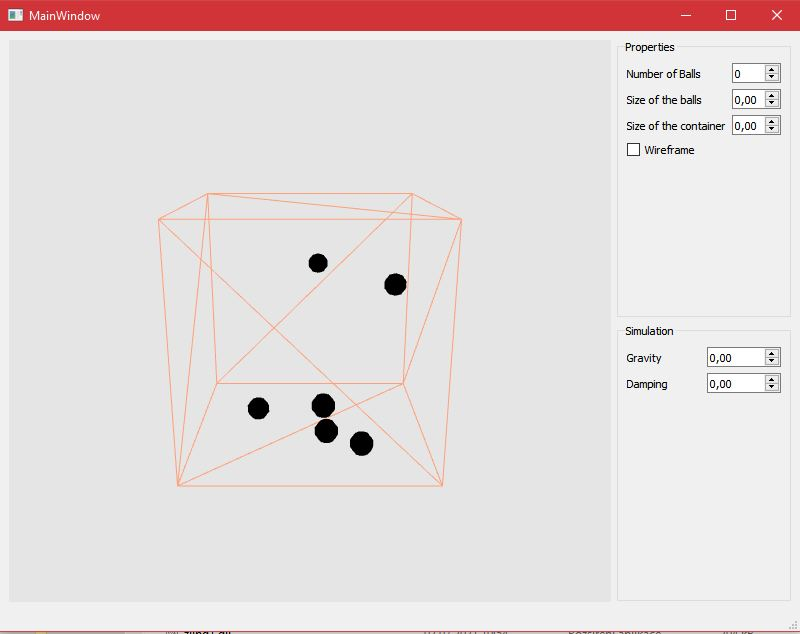

# Spring simulation
<em>
Animation Software Engineering, Bournemouth University 
Alexandra Kim Bui 
</em>

## Introduction
This is the application for bouncing ball simulation. The application creates bouncing ball colliding with the container and with each other.

## Install
1. Run cmake from the created build directory.
2. Run cmake build from the build directory.

## Technical details
For this setup is NGL library required